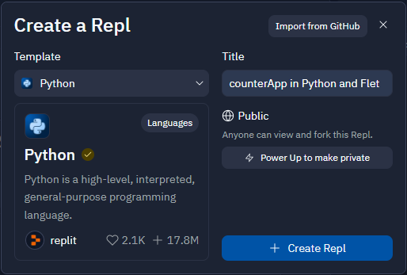
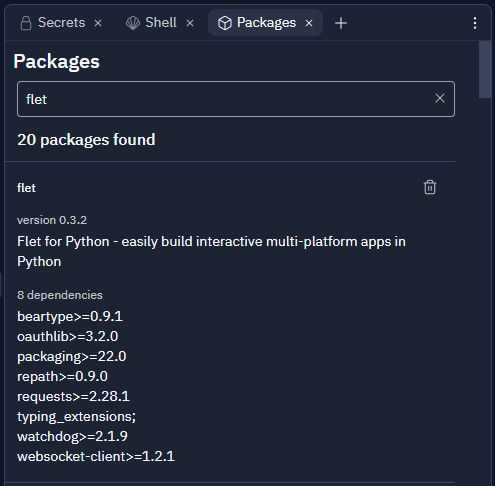
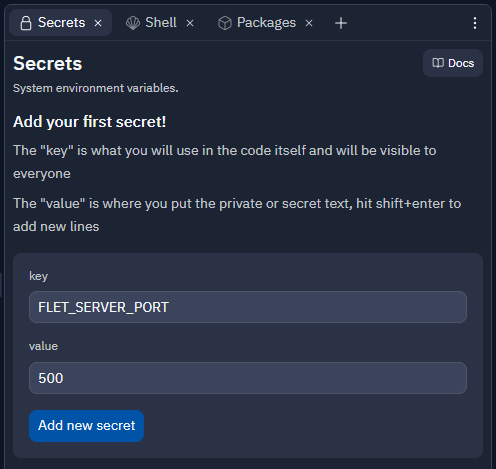
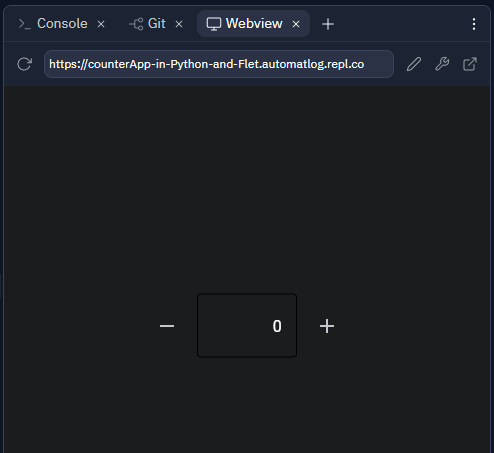

# Flet | Flutter apps in Python 
> Flet enables developers to easily build realtime web, mobile and desktop apps in Python. No frontend experience required.

## Introduction
### What is Flet
Flet is a framework that allows building interactive multi-user web, desktop and mobile applications in your favorite language without prior experience in frontend development.

You build a UI for your program with Flet controls which are based on Flutter by Google. Flet does not just "wrap" Flutter widgets, but adds its own "opinion" by combining smaller widgets, hiding complexities, implementing UI best-practices, applying reasonable defaults - all to ensure your apps look cool and professional without extra efforts.

### Flet app example
[Counter app](https://replit.com/@Automatlog/counterApp-in-Python-and-Flet?v=1)

## To run your app on Replit:
1.[Signup](https://replit.com) on Replit.

2.Click "New repl" button.

3.Select "Python" language from a list and provide repl name, e.g. my-app.

4.Click "Packages" tab and search for flet package; select its latest version.

5.Click "Secrets" tab and add FLET_SERVER_PORT variable with value 5000.

6.Switch back to "Files" tab and copy-paste your app into main.py.

7.Run the app.
`Enjoy.`

{Demo}

